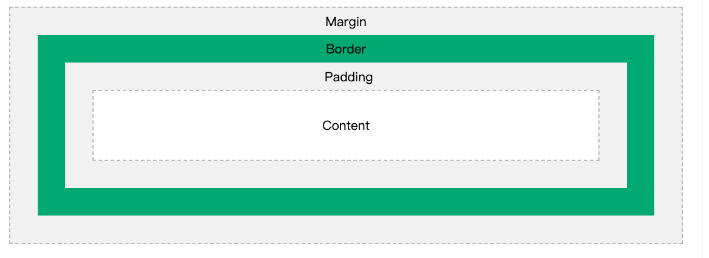

# CSS All In One Page

## 目的
本文作为CSS技术的大纲，讲述了CSS的基本原理和简单的操作，试图阐述各个名词在CSS中扮演的角色。

## 总览


<iframe src='https://app.boardos.online/board/embed/6155a17f8b048703ada5cd54?target=Dqzyg4D2yWDQXP71e77tb' width='100%' height='480px' style='min-width: 640px; min-height: 480px; background-color: #f4f4f4; border: 1px solid #efefef' sandbox='allow-same-origin allow-scripts allow-modals allow-popups allow-popups-to-escape-sandbox' allowfullscreen='true' webkitallowfullscreen='true' mozallowfullscreen='true'></iframe>

CSS(Cascading Style Sheet)[^wiki^](https://en.wikipedia.org/wiki/CSS)是一种说明性的语言，用来指示html中的每一个元素的位置，样式等。

## Example

<iframe height="300" style="width: 100%;" scrolling="no" title="Untitled" src="https://codepen.io/unlockingc/embed/eYENVjB?default-tab=html%2Cresult&editable=true" frameborder="no" loading="lazy" allowtransparency="true" allowfullscreen="true">
  See the Pen <a href="https://codepen.io/unlockingc/pen/eYENVjB">
  Untitled</a> by unlockingc (<a href="https://codepen.io/unlockingc">@unlockingc</a>)
  on <a href="https://codepen.io">CodePen</a>.
</iframe>


一个样式必须完成两个步骤：
1. 从HTML中选择一个元素集合
2. 对集合的所有元素进行样式设置


## Where
[CSS可以被放在HTML的3个地方](https://www.runoob.com/css/css-howto.html)：
1. 页内样式
2. 引用页外单独文件
3. 内联样式

``` html
<!--页面外单独文件-->
<head>
<link rel="stylesheet" type="text/css" href="mystyle.css">
</head>

<!--页内样式-->
<head>
<style>
hr {color:sienna;}
p {margin-left:20px;}
body {background-image:url("images/back40.gif");}
</style>
</head>

<!--内联样式(embed)-->
<p style="color:sienna;margin-left:20px">这是一个段落。</p>
```

## Selector
从DOM中选择出一个元素集合
具体如下举例:

``` css
div {  /*选择了文档中所有的div元素*/
}

div.my-class-name1.my-class-name2 {
        /*选择了所有形如
        <div class="my-class-name1 my-class-name2">content</div>
        的元素*/
}

div>div {
        /*选择了形如
        <div>
                <div>
                </div>
        </div>的元素
        这里两个div在DOM树中是父子关系，之间没有别的元素
        */
}

div#id42 .descendant-class-name {
        /*选择了形如
        <div id="id42">
                ...
                <? class="descendant-class-name">
                        content
                <?>
                ...
        </div>
        注意这里是后代，不是儿子
        */
}

* {
        /*选择了所有元素*/
}

a[href="https://wwww.baidu.com"] {
        /*选择了所有链接地址是百度的超链接元素*/
}

```

### Pseudo
伪元素是一种在CSS渲染时可以在元素前后添加的元素。
主要用作丰富阴影和过渡效果。
之所以称为伪，是指不在DOM树之内。

<iframe height="300" style="width: 100%;" scrolling="no" title="css-pseudo" src="https://codepen.io/unlockingc/embed/yLoNzoN?default-tab=css%2Cresult&editable=true" frameborder="no" loading="lazy" allowtransparency="true" allowfullscreen="true">
  See the Pen <a href="https://codepen.io/unlockingc/pen/yLoNzoN">
  css-pseudo</a> by unlockingc (<a href="https://codepen.io/unlockingc">@unlockingc</a>)
  on <a href="https://codepen.io">CodePen</a>.
</iframe>

### 参考资料
1. [CSS3 selector详解](https://developer.mozilla.org/en-US/docs/Web/CSS/CSS_Selectors)
2. [CSS3 选择器列表](https://www.w3schools.com/cssref/css_selectors.asp)

## Weight
当一个元素被多个css作用时，weight(权重)最大的那个生效。
::: tip Where cascading from
css就像是一层一层刷上去的，权重最大的在最表面，所以叫层叠样式表
:::

其中
- [内联样式][css.md/how]
- 每出现一个id，权重+100
- 每出现一个class，权重加10
- 其他+1

样例如下：

<iframe height="300" style="width: 100%;" scrolling="no" title="cascading-css" src="https://codepen.io/unlockingc/embed/XWabzgE?default-tab=css%2Cresult&editable=true" frameborder="no" loading="lazy" allowtransparency="true" allowfullscreen="true">
  See the Pen <a href="https://codepen.io/unlockingc/pen/XWabzgE">
  cascading-css</a> by unlockingc (<a href="https://codepen.io/unlockingc">@unlockingc</a>)
  on <a href="https://codepen.io">CodePen</a>.
</iframe>


### 参考资料
[https://www.runoob.com/css/css-howto.html](https://www.runoob.com/css/css-howto.html)


## Layout
当我们成功选择元素之后，首先需要考虑的是元素的布局。即如何用某种语言灵活地描述二维平面上各个元素的位置关系。

### [Box Model](https://www.w3schools.com/css/css_boxmodel.asp)
在理解布局之前，需要先理解Box Model。浏览器会将每一个DOM元素看作平面上的一个盒子，这个盒子有4个部分：
1. margin：元素外部距离其他元素的留白
2. border：元素的边框，可以设置颜色
3. padding：元素内部距离气内容的距离
4. content：可以是子元素，也可以是简单的文字，简而言之，DOM树中的子节点

具体如图：



### Normal Flow
#### Box Flow(default)
在Box flow中，所有元素从左到右从上到下依次排列
::: tip BFC(Box Formatting Context)
[BFC](https://developer.mozilla.org/en-US/docs/Web/Guide/CSS/Block_formatting_context)即指在Box layout中每个元素的context信息，类似于：我前面是谁，后面是谁，我在哪。
:::


#### Flex Flow
Flex layout是比较新的排列方式，主要的优点在于自适应能力, 它是一个维度布局方法。具体思路如下：
1. 将二维屏幕划分成若干个竖条或横条
2. 在每个条中，你可以设置各个元素的宽度/高度占比、对齐方式、间隔等

相对于box layout， 它提供更多的可选项，从而使得响应式设计（adaptive design：意指布局跟随不同显示设备进行友好的排练，不导致内容杂乱或难以操作）更加容易。

**一些资料:**

1. [runoob: 一个详细的教程](https://www.runoob.com/w3cnote/flex-grammar.html)
2. [css-tricks:一份完整的文档](https://css-tricks.com/snippets/css/a-guide-to-flexbox/)
3. [FLEXBOX FROGGY: 一个有效的练习](https://flexboxfroggy.com/)

#### Grid FLow
Grid layout是截止2021年最新的排列方式，他将屏幕划分成若干个grid，
每个元素可以占1到多个grid。

参考样例如下：

<iframe height="300" style="width: 100%;" scrolling="no" title="css-grid-demo-cube" src="https://codepen.io/unlockingc/embed/porJaJM?default-tab=css%2Cresult&editable=true" frameborder="no" loading="lazy" allowtransparency="true" allowfullscreen="true">
  See the Pen <a href="https://codepen.io/unlockingc/pen/porJaJM">
  css-grid-demo-cube</a> by unlockingc (<a href="https://codepen.io/unlockingc">@unlockingc</a>)
  on <a href="https://codepen.io">CodePen</a>.
</iframe>

**一些资料:**
1. [runoob:一份详尽的教程](https://www.runoob.com/w3cnote/android-tutorial-gridview.html)
2. [css-tricks:一份完整的文档](https://css-tricks.com/snippets/css/complete-guide-grid/)

::: warning
Grid layout作为一个比较新的方式，至2021年很多浏览器还没有支持
:::

## Design

### Plane design

### 3D design

### Animation